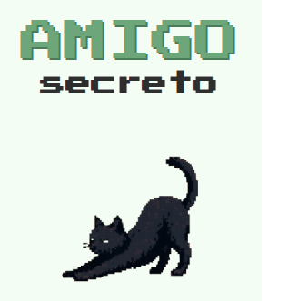
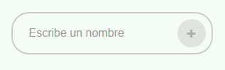
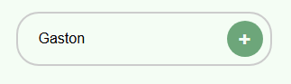
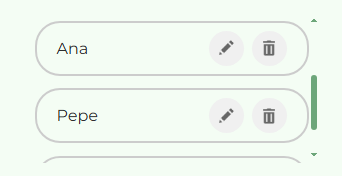
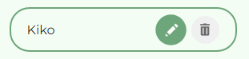
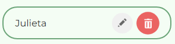
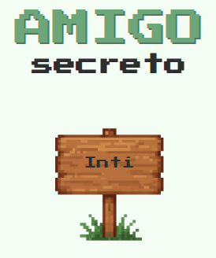

# 🧑‍🤝‍🧑 Amigo Secreto
Aplicación web sencilla para agregar nombres de amigos, visualizarlos en una lista y realizar un sorteo aleatorio para elegir uno de ellos. Ideal para juegos, rifas o decisiones al azar.

## 🚀Prueba la app

<a href="https://gpelo-data.github.io/challenge-amigo-secreto/" target="_blank">
  Amigo Secreto
</a>

## 🚀 Funcionalidades
✅ Agregar nombres sin duplicados.

✅ Visualizar lista de amigos agregados.

✅ Sortear un amigo al azar.

✅ Reiniciar la lista y empezar de nuevo.

✅ Validación de entradas vacías o repetidas.

✅ Eliminar un amigo.

✅ Editar el nombre de un amigo ingresado.

## 🧱 Tecnologías usadas
◾ HTML

◾ CSS

◾ JavaScript

◾ Chatgpt: para generación de imágenes

◾ Github y Git

## 📋 Amigo Secreto -  Guía de uso

**1. Portada**  
Pantalla inicial de la aplicación Amigo Secreto donde puedes comenzar a organizar tu intercambio de regalos.  

**2. Input**  
Ingresa los nombres de los participantes en el campo de texto. Puedes agregar tantos amigos como desees para el sorteo.  

**3. Input-ejemplo**  
Ejemplo de cómo completar el formulario con nombres de participantes. Simplemente escribe cada nombre y agrégalo a la lista.  

 
**4. Listado**    
Visualiza todos los participantes que has agregado. Aquí puedes revisar la lista completa antes de realizar el sorteo.  

**5. Editar**    
Modifica los nombres de los participantes si necesitas hacer algún cambio antes del sorteo final.  

**6. Borrar**    
Elimina participantes de la lista si es necesario. Confirma la acción para mantener tu lista actualizada.  

**7. Resultado**    
¡Resultado final! La aplicación muestra quién es tu amigo secreto. 

## 📢 Contacto

<a href="https://www.linkedin.com/in/gpelo-data/" target="_blank">
  
  LinkedIn
</a>

 

<a href="mailto:gaston.pelo.contacto@gmail.com" target="_blank">
  
  gaston.pelo.contacto@gmail.com
</a>

